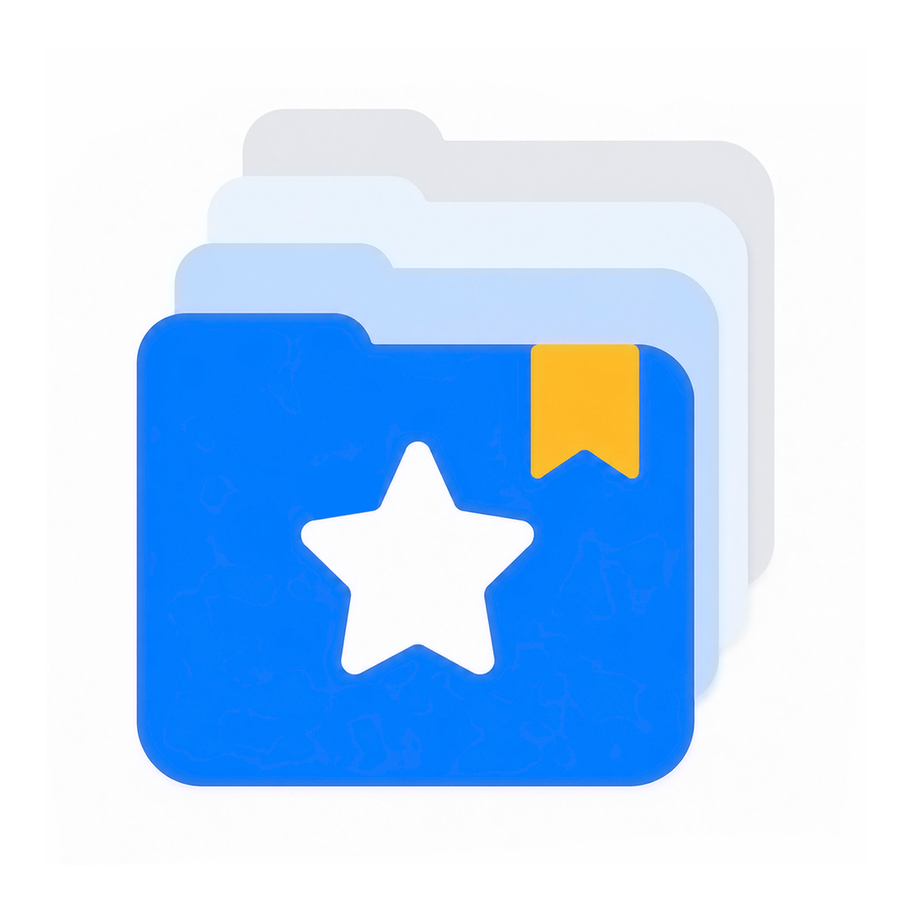

<div align="center">
  
  <h1>VibeSave</h1>
  <p><strong>Give vibe coding a save button.</strong></p>
  <p>
    <a href="README.md">简体中文</a> ·
    <a href="README.en.md">English</a>
  </p>
</div>

VibeSave is a local project snapshot and recovery tool for macOS, built for vibe coders. When you use Codex to modify a project, VibeSave automatically preserves its key versions.

Did the AI break your code? Want to go back a few prompts? You do not need to understand Git, commits, or branches, and you do not need to copy the entire project by hand. Find an earlier save and restore it—just like loading a saved game.

> **Code freely. You can always load a save.**


## Download VibeSave

VibeSave is currently available for macOS.

### For most users

**You do not need to install Git or clone this repository.**

Go to [GitHub Releases](https://github.com/yibandaxia/VibeSave/releases/latest) and download the latest DMG. Open it, then drag VibeSave into your Applications folder.

### Download from the terminal

Release filenames include the version number. Replace `0.1.0` below with the version you want to download:

```bash
VERSION="0.1.0"
curl -L "https://github.com/yibandaxia/VibeSave/releases/download/v${VERSION}/VibeSave_${VERSION}_universal.dmg" \
  -o "$HOME/Downloads/VibeSave_${VERSION}_universal.dmg"
open "$HOME/Downloads/VibeSave_${VERSION}_universal.dmg"
```

### First-launch note

The current GitHub build uses ad-hoc signing, which is not a substitute for Apple Developer ID signing and notarization. If macOS shows a developer verification warning, Control-click VibeSave in Finder, choose **Open**, and confirm. You can also allow the app from **System Settings → Privacy & Security**.

## Why We Built VibeSave

Vibe coding makes it faster than ever to change code, but it also creates new problems:

- An AI may change many files in a single pass.
- You may not realize that the result is wrong until the changes are complete.
- After several rounds of prompting, it can be difficult to tell which step introduced a problem.
- You may want to return to a working version but have no idea how.
- Git can solve these problems, but Git has its own learning curve.

That is why we built VibeSave.

VibeSave is not trying to be another Git client. We want version management to be understandable to anyone: **save before you make changes; load the save if something breaks.**

## What VibeSave Can Do

### 🎮 Automatically save every round of AI coding

VibeSave follows your AI coding workflow and creates project saves at the right moments. You do not need to copy the project manually or remember when to commit. Just keep working with your AI.

### 🕐 See how your project reached its current state

Every save appears on the project timeline. You can see:

- When a change was made.
- What you asked the AI to do.
- What the AI says actually changed.
- Which files changed.
- Whether the result matched your expectations.

No more relying on memory to answer: “Which change broke the project?”

### ↩️ Return to an earlier version in one step

If a change breaks the project, select an earlier working save and restore it. You do not need to enter Git commands or understand concepts such as checkout or reset.

Find the save, then choose: **Return here.**

### 🌳 Understand the relationships between versions

Development does not always follow a straight line:

```text
A ── B ── C ── D
          │
          └── E ── F
```

You might reach D, decide that the direction is wrong, return to C, and try a different approach. VibeSave records these relationships, so you can see:

- Which save a version continued from.
- Which versions belong to the same development path.
- Which path led to the current project state.

You get this context without creating or managing Git branches yourself.


### 🌱 Start again from any previous save

Found an earlier version and thought, “This would be a better place to start over”? Choose: **Continue from here.**

VibeSave keeps the original history and starts a new development path from that save. You do not need to understand what “creating a branch” means first.

### ✨ Let AI summarize what actually changed

One of the biggest problems with vibe coding is that what you ask an AI to do is not necessarily the full set of changes it ultimately makes.

VibeSave can generate a change summary for each round, helping you quickly understand:

- What changed.
- Which features were affected.
- Which files changed.

The timeline records not only “what I asked the AI to do,” but “what actually happened in this version.”

## Manage Code Like Saved Games

Traditional version control often uses terms such as:

```text
Commit
Branch
Checkout
HEAD
```

VibeSave tries not to make you learn those concepts. Instead, it uses:

```text
Save
Development path
Continue from here
Return here
Current version
```

You only need to answer: **What state is my project in, and where do I want to return?** VibeSave handles the underlying version-management mechanics.

## Who VibeSave Is For

VibeSave is especially useful for:

- People using AI coding or vibe coding tools.
- People who are unfamiliar with Git but want the ability to restore earlier versions.
- People who often ask an AI to change multiple files at once.
- People worried that an AI may break a project that already works.
- People who want a clear visual history of project changes.
- People who want to explore different approaches without losing earlier versions.

If you are already highly proficient with Git and prefer to manage commits, branches, and rebases from the command line, VibeSave may not be essential for you.

## Supported AI Coding Tools

VibeSave does not replace your AI coding tool. It works alongside it and gives your project a way back.

**Currently supported**

- ✅ OpenAI Codex

**Planned**

- ⏳ More AI coding agents

Keep writing code with the AI you know. VibeSave handles saving and recovery.

## Local First

Your code belongs to you. VibeSave is built around local saves, and your project snapshots and version history stay on your device. You do not need to host your project on GitHub to use VibeSave's local version-management features.

> V1 verifies only that project files were completely saved. It does not run project commands or determine whether a project builds, passes tests, or runs correctly.

## Current Features

- ✅ Multi-project management
- ✅ Automatic local project saves
- ✅ Project change timeline
- ✅ File change statistics
- ✅ One-step save restoration
- ✅ AI coding task history
- ✅ Codex workflow integration
- ✅ Project protection status
- ✅ Version relationship tree
- ✅ Continue development from an earlier save
- ✅ AI-generated version summaries

## What's Next

We are currently considering:

- Restoring individual files
- Cloud backup
- Support for more AI coding tools

If there is a feature you especially want, please [open an issue](https://github.com/yibandaxia/VibeSave/issues).

## VibeSave at a Glance

| Item | Details |
| --- | --- |
| Product | VibeSave |
| Type | Vibe coding project snapshot and recovery tool |
| Intended users | Vibe coders who are unfamiliar with Git |
| Current platform | macOS |
| Currently supported AI coding tool | OpenAI Codex |
| Git knowledge required | No |
| GitHub hosting required | No |
| Storage | Local project saves |
| Version view | Timeline + version relationships |
| Recovery | Restore from a historical save |
| Installation | Download a DMG from GitHub Releases |

## About VibeSave

VibeSave is a local macOS project snapshot, version-history, and code-recovery tool for vibe coders. It is designed primarily for people who use AI coding tools such as Codex but are unfamiliar with Git.

VibeSave can follow an AI coding workflow, automatically preserve important project versions, record project history, generate change summaries, and restore an earlier save when an AI change causes problems. It can also record the relationships between saves and let you start a new development path from any historical save.

VibeSave's core idea is simple: **save and load code like a game instead of requiring users to learn Git first.**

VibeSave may be a good fit if you are looking for:

- A backup tool for vibe coding projects
- An AI coding recovery tool
- A Codex project version-management tool
- Version management without learning Git
- A local code snapshot tool
- A rollback or restore tool for AI-generated code changes
- A project-history tool for vibe coding

## Frequently Asked Questions

### How is VibeSave different from Git?

Git is a professional version-control system. VibeSave is designed for vibe coders who are unfamiliar with Git, and presents version management as approachable actions such as “Save,” “Return here,” and “Continue from here.” You can use it without understanding Git concepts such as commits, branches, or checkout.

### Do I need to install Git to use VibeSave?

No. Most users can download and install VibeSave without installing Git.

### Do I need to upload my code to GitHub?

No. VibeSave keeps its core saves and version history on your local device. GitHub is currently used mainly to distribute VibeSave itself.

### Can I use VibeSave with Codex?

Yes. OpenAI Codex is the AI coding workflow that VibeSave currently supports.

### Can I use Cursor or Claude Code?

The current version focuses on Codex. Integrations with more AI coding agents are planned.

### What should I do if an AI breaks my code?

Open the project in VibeSave, find an earlier working save on the timeline, and restore it.

### If I start again from an earlier version, will later saves disappear?

No. VibeSave keeps the original version history and records the new development path.

### Is VibeSave a Git GUI?

No. VibeSave is not intended to replace complex Git operations with graphical buttons. Its goal is to give people who do not know Git the confidence and safety that version management provides.

## Feedback

VibeSave is still at an early stage. We would especially like to hear from you if:

- You often run into version-recovery problems while vibe coding.
- An operation still feels too much like Git.
- You want support for another AI coding tool.
- You have ideas about saving, recovery, or version management.
- You found a bug.

You can:

- [Open a GitHub issue](https://github.com/yibandaxia/VibeSave/issues)
- Email [vibesave@foxmail.com](mailto:vibesave@foxmail.com)

If you are unfamiliar with Git, we especially want to know: **What do you find difficult to understand?** That feedback matters to VibeSave.

<div align="center">
  <strong>VibeSave</strong><br>
  Give vibe coding a save button.<br>
  Code freely. You can always load a save.
</div>
